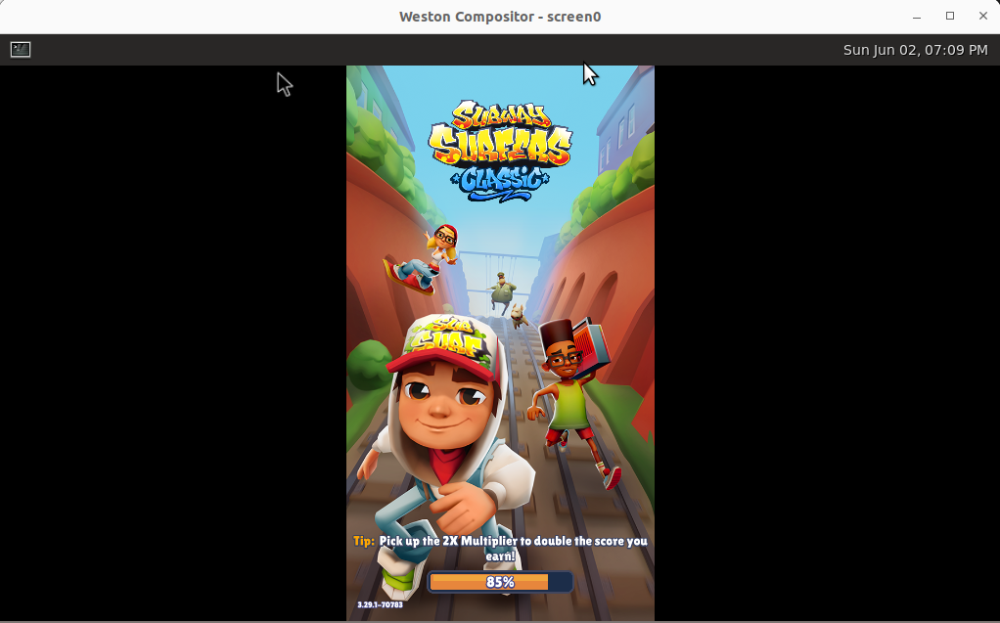

# Waydroid Management Script

This script provides a menu-driven interface for managing Waydroid, installing Weston, and additional dependencies on a Linux system. 

## Features

- Install Waydroid
- Uninstall Waydroid
- Install Weston
- Install Waydroid script and dependencies
- Install additional dependencies

## Prerequisites

- Linux-based operating system
- Bash shell
- `sudo` privileges

## Installation

1. Clone this repository or copy the script to your local machine.

2. Make the script executable:
    ```bash
    chmod +x waydroid-install.sh
    ```

3. Run the script:
    ```bash
    ./waydroid-install.sh
    ```

## Usage

When you run the script, you will be presented with a menu to choose an option:

Enter the number corresponding to the action you want to perform and follow the on-screen instructions.

### Options

1. **Install Waydroid**: Installs Waydroid and configures it with default settings.
2. **Uninstall Waydroid**: Completely removes Waydroid and its configuration files from the system.
3. **Install Weston**: Installs the Weston compositor.
4. **Install Waydroid script and dependencies**: Clones and installs the Waydroid script along with various plugins and tools.
5. **Install additional dependencies**: Installs a set of additional dependencies that might be useful for the system.
6. **Exit**: Exits the script.

## Script Details

### install_waydroid

Installs Waydroid and sets up basic configurations.

### uninstall_waydroid

Uninstalls Waydroid and removes all associated files and directories.

### install_weston

Installs Weston, a lightweight and fast compositor for Wayland.

### install_waydroid_script

Clones the Waydroid script repository and installs various plugins and tools such as `gapps`, `magisk`, `libndk`, `libhoudini`, etc.

### install_dependencies

Installs a set of additional dependencies that might be useful for enhancing your system's capabilities.

## Contributing

Feel free to submit issues or pull requests if you have any improvements or bug fixes.

## License

This project is licensed under the MIT License - see the [LICENSE](LICENSE) file for details.

## Run Program
waydroid show-full-ui
weston --backend=x11-backend.so

